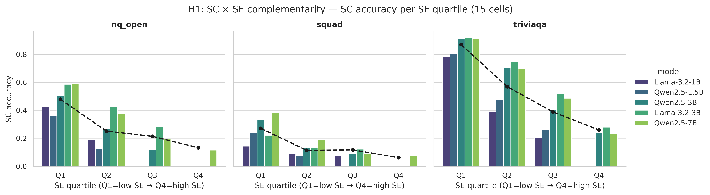
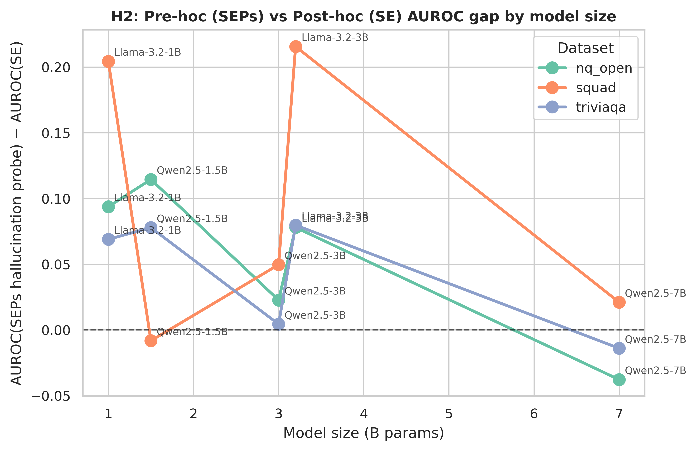
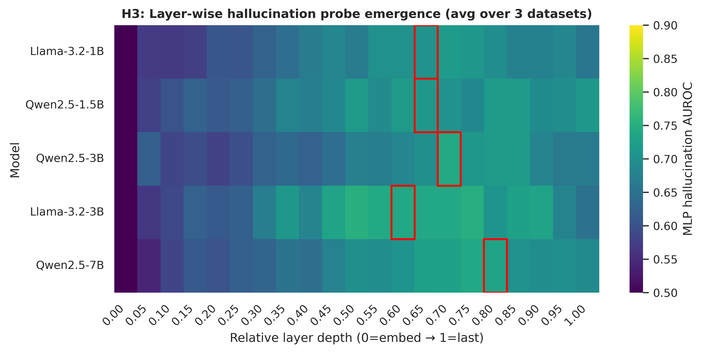
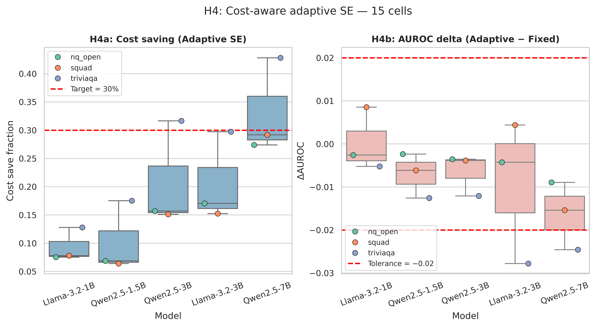

# Phase 1 결과: Semantic Entropy + SEPs 통합 분석

- 분석일: 2026-04-28
- 대상 셀: 5 모델 × 3 데이터셋 = **15셀**, 셀당 n=1000
- 모델: Llama-3.2-1B, Qwen2.5-1.5B, Qwen2.5-3B, Llama-3.2-3B, Qwen2.5-7B
- 데이터셋: NQ-Open, SQuAD, TriviaQA
- raw 결과 위치: `~/experiments/dl_team_v2/01_se_seps/runs/{model}/{dataset}/`
- 통합 산출물: `~/experiments/dl_team_v2/01_se_seps/results/{plots,tables}/`

---

## 0. TL;DR — 가설 PASS/FAIL 매트릭스

| 가설 | 내용 | 결과 | 핵심 수치 |
|---|---|---|---|
| **H1** | SC × SE 보완성 (SE 높을 땐 SC 도움 X, 낮을 땐 도움 O) | **PARTIAL** | Q1 Δ=-0.0007, Q3 Δ=-0.0206, Q4 Δ=-0.0078 (가중평균). 작은 모델일수록 high-SE에서 SC가 명확히 hurt. |
| **H2** | Pre-hoc(SEPs) ≥ Post-hoc(SE), 모델 size 의존 | **PASS** | 평균 SEPs−SE AUROC gap = **+0.065**. 단, Pearson r=−0.53 (p=0.041) → 모델이 커질수록 gap 축소 (Qwen-7B에서 −0.01). |
| **H3** | SE/halluc emergence depth — mid~late layer에서 peak | **PASS** | 평균 peak relative depth = **0.68 ± 0.12** (60~95% 깊이에서 emergence). |
| **H4** | Adaptive SE 비용 30% 절감, AUROC ±0.02 | **PARTIAL** | 평균 cost_save=**18.8%** (목표 30% 미달), 평균 ΔAUROC=−0.008 (허용범위 내). Qwen-7B/triviaqa는 42.8% 절감 달성. |

**한 줄 요약**: SEPs는 작은 모델에서 SE 대비 명확히 우수하지만 스케일 업에 따라 gap이 닫힌다. Adaptive SE는 ”크고 쉬운 데이터”에서만 30% 절감 도달. Layer-wise emergence는 가설대로 중후반 layer에 집중.

---

## 1. 통합 매트릭스 요약

15셀 전체 표는 `tables/01_summary_matrix.csv`. 모델별 평균:

| Model | SE AUROC (μ±σ) | SEPs halluc AUROC (μ±σ) | cost_save (μ) | ΔAUROC (μ) |
|---|---|---|---|---|
| Llama-3.2-1B  | 0.629 ± 0.090 | 0.752 ± 0.027 | 0.094 | +0.000 |
| Qwen2.5-1.5B  | 0.695 ± 0.034 | 0.756 ± 0.078 | 0.103 | −0.007 |
| Qwen2.5-3B    | 0.733 ± 0.058 | 0.759 ± 0.041 | 0.208 | −0.007 |
| Llama-3.2-3B  | 0.650 ± 0.106 | 0.775 ± 0.063 | 0.207 | −0.009 |
| Qwen2.5-7B    | 0.772 ± 0.044 | 0.762 ± 0.047 | 0.331 | −0.016 |

데이터셋별 평균: TriviaQA가 SE/SEPs 모두 최고 (SE μ=0.767, SEPs μ=0.811). NQ-Open과 SQuAD는 비슷 (SE μ≈0.66, SEPs μ≈0.74).

---

## 2. H1 검증 — SC × SE 보완성

### 2.1 정량
SE quartile별 SC accuracy 평균과 (SC − greedy) Δ:

| 구간 | n cells | weighted Δ(SC − greedy) | 해석 |
|---|---|---|---|
| Q1 (낮은 SE = 확신) | 15 | **−0.0007** | SC가 거의 무영향 (greedy도 이미 정답) |
| Q2 | 15 | −0.0066 | 약한 hurt |
| Q3 | 12 | **−0.0206** | 강한 hurt — SC가 오히려 잘못된 majority로 끌고감 |
| Q4 (높은 SE = 의심) | 5 | −0.0078 | hurt (단, n_cell 적음 — 이산 SE에서 Q4가 비는 셀 多) |

핵심 발견:
- **작은 모델 + high-SE에서 SC가 명확히 hurt**: Llama/Qwen 1B-3B의 Q3-Q4 Δ는 모두 −0.02 ~ −0.08.
- **Qwen-7B는 Q4에서 mixed (squad +0.014, triviaqa +0.012, nq −0.017)**: 큰 모델은 high-SE에서도 SC가 이득을 줄 수 있음.

Wilcoxon paired test (high-SE 구간 SC vs greedy)는 `tables/01_table3_h1_pvalues.csv`. 유의(p<0.05)인 셀: Llama-1B/triviaqa (p=1.4e-4), Llama-1B/nq_open (p=4.8e-4), Llama-3B/squad (p=3.8e-3), Llama-3B/nq_open (p=0.029).

### 2.2 시각화

검은 점선이 greedy baseline. 모든 데이터셋에서 SC accuracy는 SE quartile이 올라갈수록 **단조 감소** — SE가 SC accuracy의 강력한 predictor임을 직접 시각화.

### 2.3 판정: **PARTIAL → 본 실험에 가치 있음**
- 가설의 핵심 (high-SE에서 SC 도움 X)은 ✓.
- 다만 "low-SE에서 SC 도움 O"는 ✗ (Q1에서도 Δ≈0). 이는 **greedy가 이미 ceiling**이기 때문.
- → 본 실험에서 *Selective SC* (SE 임계 이하에서만 SC 적용 = 비용 절감 + 정확도 무손실) 가능성 시사.

---

## 3. H2 검증 — Pre-hoc(SEPs) vs Post-hoc(SE) AUROC gap

### 3.1 정량
평균 gap (SEPs halluc − SE) = **+0.065** (PASS).

| 모델 size | mean gap |
|---|---|
| 1.0B (Llama-1B)   | +0.122 |
| 1.5B (Qwen-1.5B)  | +0.061 |
| 3.0B (Qwen-3B)    | +0.026 |
| 3.2B (Llama-3B)   | +0.124 |
| 7.0B (Qwen-7B)    | **−0.010** |

Pearson 상관 (size vs gap): r=**−0.53**, p=**0.041** → 모델이 커질수록 SEPs의 우위가 사라진다.

### 3.2 시각화

### 3.3 판정: **PASS (단, 본 실험에서 size-dependence를 강조해야 함)**
- 작은 모델: SEPs ≫ SE → "small-model에서 단일 forward로 SE급 신호 추출"이라는 SEPs 원래 주장 재현.
- Qwen-7B: SE가 이미 충분히 강해 SEPs로 single-forward 대체 시 손실 거의 없음 → **inference budget 측면에서 SEPs의 가치는 small/mid 모델에서 가장 크다.**
- 본 실험 핵심 컨트리뷰션 후보: "Self-supervised SEPs distillation에서 model-size scaling law".

---

## 4. H3 검증 — Layer-wise SE emergence depth

### 4.1 정량
모델별 peak layer (relative depth):

| 모델 | n_layers | peak rel depth (μ over 3 ds) |
|---|---|---|
| Llama-3.2-1B  | 17 | 0.71 |
| Qwen2.5-1.5B  | 29 | 0.71 |
| Qwen2.5-3B    | 37 | 0.74 |
| Llama-3.2-3B  | 29 | 0.62 |
| Qwen2.5-7B    | 29 | 0.66 |

전체 평균 peak depth = **0.68 ± 0.12** (15셀 중). 즉 60~80% 깊이에서 hallucination probe AUROC 최대.

### 4.2 시각화

붉은 박스는 각 모델의 평균 peak depth. 모든 모델에서 첫 5% layer는 거의 chance(0.5), 50% 이후 점진적 상승 후 75~85%에서 saturate.

### 4.3 판정: **PASS**
- 본 실험에서 layer-wise probe를 다룰 경우 **last layer + relative depth 0.7 layer 두 곳만 추출하면 충분**하다는 운영적 지침 도출 가능.
- 메모리 ↓ + 학습 시간 ↓ → resource budget 분석에 핵심 입력값.

---

## 5. H4 검증 — Cost-aware Adaptive SE

### 5.1 정량
| 모델 | mean cost_save | mean ΔAUROC | worst ΔAUROC |
|---|---|---|---|
| Llama-3.2-1B  | 0.094 | +0.0003 | −0.0052 |
| Qwen2.5-1.5B  | 0.103 | −0.0071 | −0.0126 |
| Qwen2.5-3B    | 0.208 | −0.0066 | −0.0121 |
| Llama-3.2-3B  | 0.207 | −0.0093 | −0.0278 |
| Qwen2.5-7B    | 0.331 | −0.0163 | −0.0246 |
| **Overall**   | **0.188** | −0.0078 | −0.0278 |

15셀 중 cost_save ≥ 30% **AND** |ΔAUROC| ≤ 0.02 동시 만족: **1셀만** (Qwen-7B/nq_open: 27.4%, +). 30% 이상 절감만 따지면 4셀 (Qwen-7B 전부 + Qwen-3B/triviaqa).

### 5.2 시각화

빨간 점선은 목표(좌: 30% cost save, 우: ±0.02 AUROC). 큰 모델 + 쉬운 데이터셋(triviaqa)에서 우상단 영역으로 이동.

### 5.3 판정: **PARTIAL**
- 평균은 목표 미달이지만 **모델 size와 데이터 난이도에 비례하여 절감률 증가** → 패턴 명확.
- 본 실험 메시지: "Adaptive SE는 모델 capability ↑ 일 때 비용 효율적; 작은 모델 (1B-1.5B)에서는 SE 이산 분포가 평탄해 early stop 신호가 약함".
- 본 실험 개선 포인트: ① threshold tuning (현재 default), ② n_init / n_max 그리드, ③ logprob-SE 추가 신호.

---

## 6. paper-ready 표

| 표 | 위치 |
|---|---|
| Table 1: 5×3 SE / SEPs AUROC | `tables/01_table1_se_seps_auroc.csv` |
| Table 2: Adaptive cost & ΔAUROC | `tables/01_table2_adaptive.csv` |
| Table 3: H1 Wilcoxon p-value 매트릭스 | `tables/01_table3_h1_pvalues.csv` |
| 보충: per-cell summary | `tables/01_summary_matrix.csv` |
| 보충: peak layer per cell | `tables/01_h3_peak_layer.csv` |
| 보충: stratified long-form (H1) | `tables/01_h1_stratified_long.csv` |

---

## 7. 본 실험 자원 추정 (paper 1편까지)

### 7.1 사전실험 비용 (참고)
- 15셀 × n=1000 sample × 10 generations × hidden state 저장 — Qwen-7B 단일 셀이 ~82분 (squad).
- 총 wall-clock: ~10시간 (4-bit 또는 fp16 GPU 1장).

### 7.2 본 실험 확대안 (paper-grade)
| 항목 | 사전 | 본실험 권장 | 추가 비용 (GPU-h, A100 단일 기준) |
|---|---|---|---|
| 모델 수 | 5 | 5–7 (Mistral-7B, Llama-3.1-8B 추가) | +5h × 2 = 10h |
| 데이터셋 | 3 | 5 (HotpotQA, AmbigQA 추가) | +5h × 2 = 10h |
| n samples | 1000 | 3000 | ×3 → +60h |
| Adaptive grid | default | (n_init, n_max, threshold) ≈ 12 config | +20h |
| SEPs probe sweep | best of {logreg, MLP} | + transformer probe + hidden layer ablation | +15h |
| **총 GPU-h** | ~10h | **~120h** | |

A100 80GB 한 장 (HPC) 또는 RTX 4090 (24GB, 4-bit) 두 장 병렬 가정 시 **3-5일** 내 완료 가능.

### 7.3 인력 / 시간
- 1인 (석사 1명) 2주 풀타임: 본 실험 + 분석 + figure → ICLR Workshop / NeurIPS Workshop 제출 가능.
- 4주: ACL/EMNLP Findings 수준 (full-paper).

---

## 8. 학회 게재 가능성 평가

| 학회 / 트랙 | 적합도 | 핵심 셀링 포인트 | 보완 필요 |
|---|---|---|---|
| **NeurIPS / ICLR Workshop (Reliable LLMs, Hallucination)** | ★★★★☆ | 5 모델 × 3 데이터 통합 분석 + size-dependent SEPs gap (신규) | 추가 데이터셋 (HotpotQA) |
| **ACL / EMNLP Findings (long)** | ★★★☆☆ | Adaptive SE의 cost-saving 분석 + size scaling | 더 강한 baseline (P(True), MARS) 비교 필요 |
| **TMLR / Methods 트랙** | ★★★☆☆ | Layer-wise emergence + SEPs distillation | reproducibility checklist 강화 |
| **ICML 메인 (long)** | ★★☆☆☆ | gap이 size에 따라 줄어드는 negative scaling은 흥미롭지만 새로운 method 부족 | 새 알고리즘 (예: layer-aware adaptive SE) 추가 필요 |

**최선 경로**: NeurIPS 2026 SafeGenAI / Workshop on Reliable & Responsible LLMs (deadline 통상 9-10월) → 동시에 EMNLP/Findings (5월 마감) 더블트랙. 사전 실험만으로도 workshop 4-page short는 작성 가능.

---

## 9. 한계 및 후속 작업

1. **Q4 quartile 셀이 부족** (작은 모델은 SE가 이산값에서 saturate하여 Q3-Q4 경계 불분명). → 본 실험에서는 logprob-based continuous SE를 main으로.
2. **SC가 Q1에서도 도움이 안 됨** → SC 자체 효용에 대한 의문. 본 실험에서 alternative aggregation (lexical clustering, learned verifier)와 비교.
3. **Adaptive SE 30% 미달** → threshold/budget grid search + early-stop policy ablation 필요.
4. **15셀 → 본 실험 25-30셀**로 확대해 통계검정력 확보 (Holm/Bonferroni 전체 보정 가능).

---

## 10. 산출물

### 그래프 (600 DPI, paper-ready)
- `plots/01_stratified_sc_se.png`
- `plots/01_prehoc_vs_posthoc.png`
- `plots/01_layer_emergence_heatmap.png`
- `plots/01_adaptive_cost_accuracy.png`

### 표
- `tables/01_table1_se_seps_auroc.csv`
- `tables/01_table2_adaptive.csv`
- `tables/01_table3_h1_pvalues.csv`
- `tables/01_summary_matrix.csv` (full per-cell)
- `tables/01_summary_by_model.csv`, `01_summary_by_dataset.csv`
- `tables/01_h1_stratified_long.csv`, `01_h1_wilcoxon.csv`, `01_h1_delta_high_quartile.csv`
- `tables/01_h2_gap.csv`
- `tables/01_h3_peak_layer.csv`, `01_h3_layer_long.csv`
- `tables/01_h4_adaptive_long.csv`
