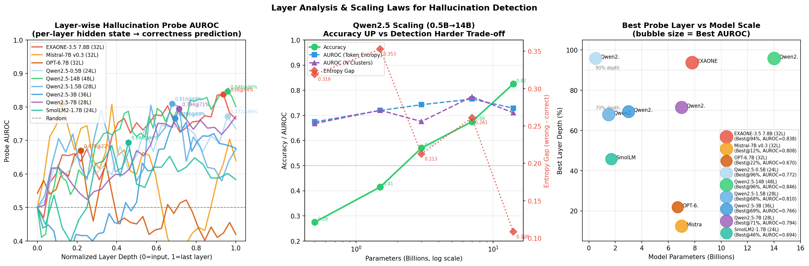
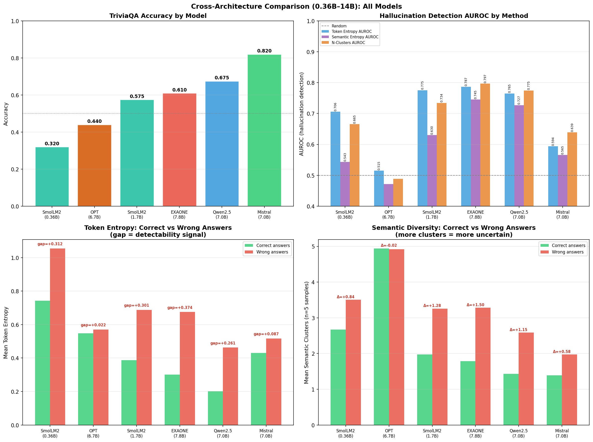

# Hallucination Detection in Local LLMs

> 딥러닝 텀프로젝트 — LLM이 답변을 생성하기 **전에** hallucination을 탐지할 수 있는가?

---

## Overview

대형 언어 모델(LLM)은 사실에 기반하지 않은 답변을 높은 확신으로 생성하는 **hallucination** 문제를 가진다.  
본 프로젝트는 토큰 엔트로피, semantic entropy, 레이어 프로브 등 **8가지 방법론**을 통해 이를 사전 탐지하고, 내부 표현(hidden state)에서 hallucination 정보가 어디에 인코딩되는지 분석한다.

### Research Questions

- **RQ1.** 출력이 완전히 생성되기 전, 토큰 생성 과정에서 hallucination을 탐지할 수 있는가?
- **RQ2.** Hallucination 정보는 모델 내부의 어느 레이어에 인코딩되며, 파라미터 수·아키텍처와 어떤 관계인가?

---

## Key Results

### Best Detection Performance (EXAONE-3.5-7.8B, TriviaQA n=300)

| Method | AUROC | Note |
| --- | --- | --- |
| **N-Clusters (Semantic Entropy)** | **0.839** | Best |
| Token Entropy (max) | 0.798 | |
| Semantic Entropy (raw) | 0.783 | |
| Layer Probe (L30/32) | **0.838** | Architecture-agnostic |
| Verbalized Confidence | 0.752 | |
| Self-Consistency (majority vote) | 0.661 | Worst |

### Scaling Law — Qwen2.5 (0.5B → 14B)



> **Key finding**: 정확도↑ vs Entropy Gap↓ 의 강한 트레이드오프 (r = −0.86).  
> 크고 정확한 모델일수록 엔트로피 기반 탐지가 어려워진다.

### Cross-Architecture Comparison (~7B models)



| Model | Accuracy | AUROC (Entropy) | AUROC (N-Clust) | Entropy Gap |
| --- | --- | --- | --- | --- |
| Mistral-7B-v0.3 | **0.820** | 0.594 ⚠️ | 0.639 | +0.087 |
| Qwen2.5-7B | 0.675 | 0.765 | 0.775 | +0.261 |
| EXAONE-3.5-7.8B | 0.610 | 0.787 | **0.797** | **+0.374** |

> **Mistral anomaly**: 가장 높은 정확도(82%)이지만 엔트로피 AUROC=0.594 (≈ random).  
> Layer probe 분석으로 원인 규명 → **레이어 4(12% 깊이)에서 이미 hallucination 결정**, 이후 28개 레이어는 유창한 텍스트 생성에만 집중.

### Layer Probe — Where Is Hallucination Encoded?

| Model | Params | Best Layer | Depth | Probe AUROC |
| --- | --- | --- | --- | --- |
| Mistral-7B-v0.3 | 7.0B | L4/32 | **12%** ← anomaly | 0.808 |
| Qwen2.5-1.5B | 1.5B | L19/28 | 68% | 0.810 |
| Qwen2.5-7B | 7.0B | L20/28 | 71% | 0.794 |
| EXAONE-3.5-7.8B | 7.8B | L30/32 | 94% | 0.838 |
| Qwen2.5-14B | 14.0B | L46/48 | 96% | **0.846** |

---

## Models

| Model | Params | Layers | Family |
| --- | --- | --- | --- |
| SmolLM2-360M-Instruct | 0.36B | 32 | SmolLM (HuggingFaceTB) |
| Qwen2.5-0.5B-Instruct | 0.5B | 24 | Qwen (Alibaba) |
| SmolLM2-1.7B-Instruct | 1.7B | 24 | SmolLM |
| Qwen2.5-1.5B-Instruct | 1.5B | 28 | Qwen |
| Qwen2.5-3B-Instruct | 3.0B | 36 | Qwen |
| OPT-6.7B | 6.7B | 32 | OPT (Meta) |
| Qwen2.5-7B-Instruct | 7.0B | 28 | Qwen |
| Mistral-7B-Instruct-v0.2/v0.3 | 7.0B | 32 | Mistral |
| Falcon-7B-Instruct | 7.0B | 32 | Falcon (TII) |
| EXAONE-3.5-7.8B-Instruct | 7.8B | 32 | EXAONE (LG AI) |
| Qwen2.5-14B-Instruct | 14.0B | 48 | Qwen |

---

## Experiments

| # | Name | Description |
| --- | --- | --- |
| 01 | Token Entropy | 토큰별 logit 분포 엔트로피 |
| 02 | Semantic Entropy | 의미 클러스터링 기반 엔트로피 (Kuhn et al., 2023) |
| 03 | Self-Consistency | 반복 샘플링 일관성 |
| 04 | Calibration (ECE) | Expected Calibration Error |
| 05 | Verbalized Confidence | 모델의 자기 확신도 언어화 |
| 06 | Layer Probe | 레이어별 hidden state → correctness probe |
| 07 | Scaling Analysis | Qwen 0.5B→14B 스케일링 |
| 08 | Cross-arch Comparison | 다중 아키텍처 비교 |
| **09** | **Multi-Dataset** | TriviaQA / MMLU / NaturalQuestions 일반화 |
| **10** | **Intervention** | Layer probe 기반 실시간 재샘플링으로 정확도 개선 |

---

## Project Structure

```text
hallucination_detect/
├── configs/
│   ├── models.yaml          # 모든 모델 설정 (11종)
│   └── experiments.yaml     # 실험 하이퍼파라미터
├── src/
│   ├── model_loader.py      # 통합 모델 로딩 + chat template
│   ├── generation.py        # logit/score 캡처 생성
│   ├── hidden_states.py     # 레이어 hidden state 추출 + probe
│   └── metrics/
│       ├── entropy.py       # Token/Semantic entropy, N-Clusters
│       ├── calibration.py   # ECE, reliability diagram
│       └── consistency.py   # Self-consistency
│   └── datasets/
│       └── loader.py        # TriviaQA / MMLU / NQ / TruthfulQA
├── experiments/
│   ├── 01_token_entropy/
│   ├── 02_semantic_entropy/
│   ├── 03_self_consistency/
│   ├── 04_calibration/
│   ├── 05_verbalized_confidence/
│   ├── 06_layer_probe/
│   ├── 07_model_scaling/
│   ├── 08_cross_model/
│   ├── 09_multi_dataset/    # NEW — dataset generalization
│   └── 10_intervention/     # NEW — probe-guided resampling
├── scripts/
│   ├── run_all.sh
│   ├── plot_scaling_layer.py
│   ├── plot_cross_model.py
│   ├── final_summary.py
│   └── export_pdf.py        # REPORT.md → PDF
├── results/
│   └── figures/             # 생성된 시각화 (git 포함)
├── REPORT.md                # 전체 연구 보고서
└── REPORT.pdf
```

---

## Quick Start

```bash
git clone https://github.com/<your-id>/hallucination-detect.git
cd hallucination-detect
pip install -r requirements.txt
```

### Run single model (all methods)

```bash
bash scripts/run_all.sh exaone
```

### Run individual experiments

```bash
# Exp01: Token Entropy
python experiments/01_token_entropy/run.py --model exaone --n_samples 300

# Exp06: Layer Probe
python experiments/06_layer_probe/run.py --model mistral --n_samples 150

# Exp07: Qwen Scaling
python experiments/07_model_scaling/run.py --n_samples 200

# Exp08: Cross-arch (all 11 models)
python experiments/08_cross_model/run_extended.py --n_samples 200

# Exp09: Multi-dataset generalization
python experiments/09_multi_dataset/run.py --model qwen_7b --n_samples 200 \
    --datasets triviaqa mmlu naturalquestions

# Exp10: Layer probe intervention
python experiments/10_intervention/run.py --model exaone --n_samples 150 \
    --threshold 0.6 --max_retries 3
```

### Visualize results

```bash
python scripts/plot_scaling_layer.py   # Layer AUROC + Scaling curves
python scripts/plot_cross_model.py     # Cross-architecture comparison
python scripts/final_summary.py        # All-methods summary
```

---

## Requirements

- Python 3.10+
- CUDA GPU (VRAM guide: 0.5B–1.7B → 4GB / 3B–7B → 16GB / 14B → 28GB)
- `pip install -r requirements.txt`

> **Note**: `results/raw/` (실험 결과 jsonl)와 `data/datasets/` (데이터셋 캐시)는  
> `.gitignore`로 제외되어 있습니다. 실험 재실행 또는 `scripts/download_datasets.py`로 재현하세요.  
> EXAONE 모델은 로컬 경로 사용 — `configs/models.yaml`의 `exaone.path` 수정 필요.

---

## Datasets

| Dataset | Task | Source |
| --- | --- | --- |
| TriviaQA | Open-domain QA | HuggingFace `trivia_qa` |
| MMLU | Multi-task MC (57 subjects) | HuggingFace `cais/mmlu` |
| NaturalQuestions | Factual QA | HuggingFace `google-research-datasets/natural_questions` |
| TruthfulQA | Adversarial QA | HuggingFace `truthful_qa` |

---

## References

- Kuhn et al. (2023). *Semantic Uncertainty: Linguistic Invariances for Uncertainty Estimation in Natural Language Generation.* **Nature**
- Wang et al. (2023). *Self-Consistency Improves Chain of Thought Reasoning in Language Models.* **ICLR 2023**
- Kadavath et al. (2022). *Language Models (Mostly) Know What They Know.* arXiv:2207.05221
- Xiong et al. (2024). *Can LLMs Express Their Uncertainty?* **ICLR 2024**
- Ji et al. (2023). *Survey of Hallucination in Natural Language Generation.* **ACM CSUR**
